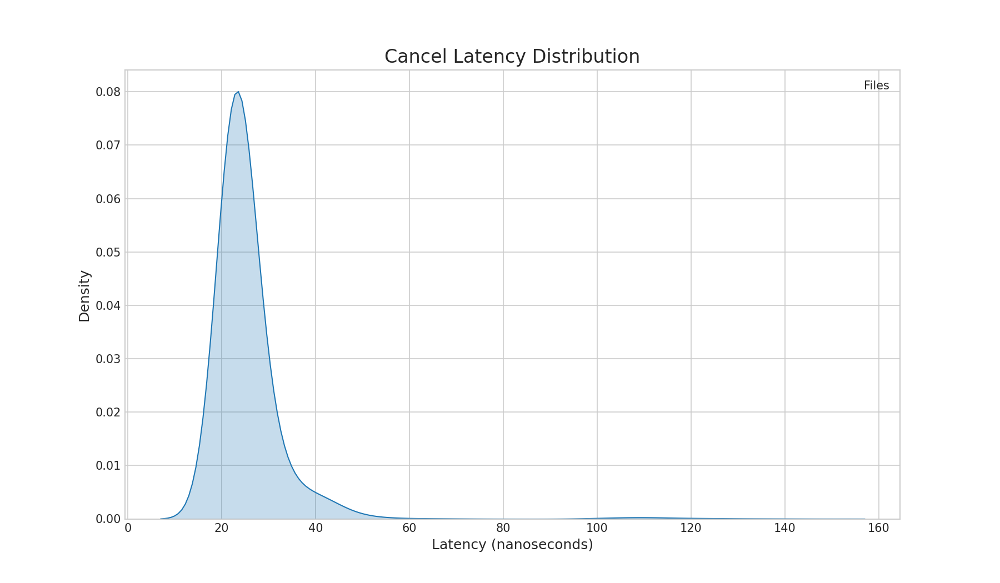
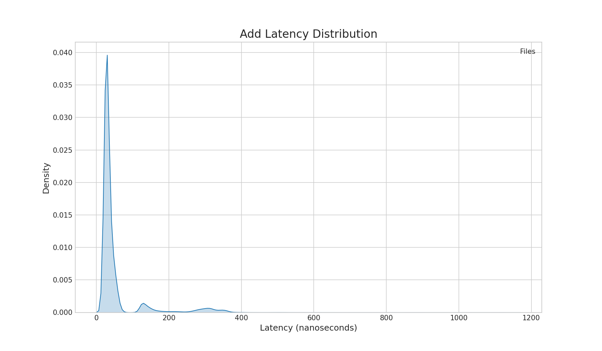

# StockeX: An Low-Latency C++23 Matching Engine

StockeX is a high-performance C++23 stock exchange matching engine simulator engineered from the ground up for **low-latency** performance. It serves as a research platform for implementing and testing advanced trading system architectures capable of processing millions of events per second with predictable, nanosecond-level determinism.

The engine's core is a novel order book implementation that leverages cache-friendly data structures, custom memory management, and modern CPU intrinsics (AVX2, BMI1) to achieve extreme performance in adding, canceling, and matching orders.

## Key Features & Architecture 🚀

The architecture is meticulously designed to minimize latency at every stage of an order's lifecycle.

* **High-Throughput Order Book**: A fully featured order book that supports limit orders for a single instrument, designed for high-frequency trading scenarios.
* **SIMD-Accelerated Order Queue**: The `OrderQueue` is a custom-built, cache-friendly data structure that uses a bitmap-based validity check.
    * It avoids linear scanning by using **AVX2** intrinsics to check 256 bits (4 x 64-bit words) of the validity bitmap at a time.
    * It leverages the `_tzcnt_u64` intrinsic (BMI1) to instantly find the next active order in the bitmap, making iteration O(1) in the best case.
* **Custom Memory Pool**: A highly efficient, pre-allocated `MemoryPool` is used for all `PriceLevel` and `OrderQueue` chunks. This strategy virtually eliminates the overhead of expensive system calls like `new` and `delete` during trading sessions.
* **Detailed Benchmarking Suite**: The project includes a comprehensive suite to measure performance under various realistic market conditions, including different order-to-trade ratios and queue fragmentation scenarios.
* **CI Integration**: A GitHub Actions workflow automatically builds and runs the test suite with multiple modern compilers (GCC 14, Clang 18) to ensure code quality and stability.

## Tech Stack 🛠️

* **Core Language**: **C++23**
* **Build System**: **CMake** (v3.20+)
* **CPU Architecture**: **x86-64** with the **Haswell instruction set** or newer is required.
    * This is necessary for the AVX2 and BMI1 intrinsics (`_mm256_testz_si256`, `_tzcnt_u64`) which are critical for performance.
* **Analysis & Visualization**: **Python 3**, Pandas, Matplotlib, Seaborn.

---

## Quickstart: Automated Benchmarking & Visualization
### Step 1: Build the Project
Ensure you build in **Release** mode to enable optimizations (`-O3`, AVX2).

```bash
# Configure
cmake -B build -DCMAKE_BUILD_TYPE=Release

# Build all executables
cmake --build build --config Release -j
```

### Step 2: Generate Simulation Data
The marketSimulation requires a binary dataset of orders. Use the simulation_generator to create one.

```bash
# Usage: ./simulation_generator <scenario> <price_std_dev> <events_count>
# Scenarios: balanced, add_heavy, cancel_heavy, match_heavy

./build/bench/simulation_generator balanced 20 2000000
```

This creates a file named simulation_balanced_20_2000000.bin in your current directory.

### Step 3: Run the Simulation
Run the simulation using the generated dataset. This will output latency statistics to .txt files (e.g., replay_latencies_ADD.txt).

```bash
# Usage: ./simulation_generator <scenario> <price_std_dev> <events_count>
# Scenarios: balanced, add_heavy, cancel_heavy, match_heavy

# Isolate CPU core 4 (optional but recommended) and run
taskset -c 4 ./build/bench/marketSimulation simulation_balanced_20_2000000.bin
```

### Step 4: Visualize Results
Use the included Python script to generate high-resolution latency histograms from the raw text files.

```bash
# Plot Add, Cancel, and Match latencies together
python scripts/plot_latency.py \
    replay_latencies_ADD.txt \
    replay_latencies_CANCEL.txt \
    replay_latencies_MATCH.txt \
    --output results.png \
    --title "Order Book Latency Profile (2M Events)"
```
## ⚡ Performance Benchmarks

```bash
./build/bench/simulation_generator balanced 20 2000000

./build/bench/marketSimulation simulation_balanced_20_2000000.bin
```

Benchmarks were conducted on an Arch Linux system with the process **pinned to a specific core** to maximize cache locality. 

| Operation | Average Latency | 99% Latency | 99.9% Latency | Throughput | Implementation Note |
|:--- |:--- |:--- |:--- |:--- |:--- |
| **CANCEL** | **~22.0 ns** | ~29.7 ns | ~40.1 ns | ~45.1M ops/sec | O(1) Lookup + Bitmap Removal |
| **ADD** | **~31.1 ns** | ~47.3 ns | ~60.2 ns | ~32.3M ops/sec | optimized chunk allocation |
| **MATCH** | **~40.3 ns** | ~95.5 ns | ~133.0 ns | ~25M ops/sec | Chunked Order Queue* |

*\*Notes:*
1. *Match Latency: Match latency is slower than others simply because it do more work. The operation is not deterministic: one match may fill 5 pending orders while another may fill 50.*
2. *System Noise: Max latencies (approx. 20-23µs) are excluded as they reflect OS-level interrupts/jitter rather than application performance.*

**System Configuration:**
* **CPU:** Intel Core i7-12700H (14 Cores / 20 Threads) @ Max 4.70GHz (24MB L3 Cache)
* **RAM:** 16GB DDR5-4800
* **OS:** Arch Linux (Kernel 6.16.7-arch1-1)
* **Compiler:** GCC 14.3.1





## Project Status & Roadmap

The core matching engine and data structures are complete and heavily benchmarked. Future work is focused on building out the surrounding system architecture.

* [ ] **Networking Layer:** Implement a TCP/UDP server for order entry and market data dissemination.
* [ ] **Inter-thread Communication:** Design and build robust, lock-free communication protocols for a multi-threaded architecture.

## License

This project is licensed under the **MIT License**.
